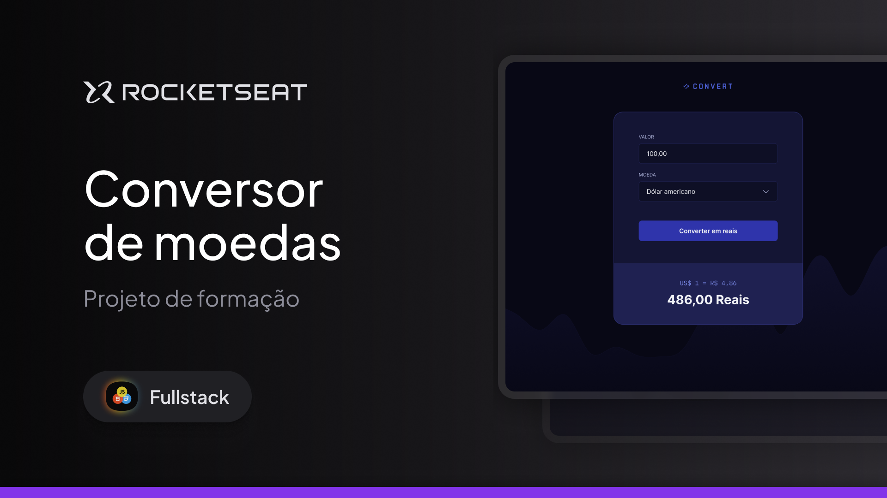

# [Class]Convert



Convert é uma aplicação web de conversão de moedas para real. Esse é um dos projetos desenvolvidos em aula na formação FullStack da Rocketseat.

## 🚀 Tecnologias

Este projeto foi desenvolvido com as seguintes tecnologias:

- HTML
- CSS
- JavaScript

## 📌 Funcionalidades

- Conversão de moedas (USD, EUR, GBP) para BRL
- Interface responsiva e interativa
- Validação de entrada do usuário

## 📂 Estrutura do Projeto

```plaintext
📂 convert
 ├── 📁 img           # Imagens do projeto
 ├── 📄 index.html    # Estrutura da página
 ├── 📄 styles.css    # Estilização do projeto
 ├── 📄 scripts.js    # Lógica da conversão
 ├── 📄 README.md     # Documentação do projeto
```

## 🔧 Como executar o projeto

1. Clone este repositório
   ```sh
   git clone https://github.com/Caiobalduino/-class-convert.git
   ```
2. Acesse a pasta do projeto
   ```sh
   cd -class-convert
   ```
3. Abra o arquivo `index.html` no navegador

## 📝 Licença

Este projeto está sob a licença MIT. Sinta-se livre para modificá-lo e usá-lo como quiser.

---
